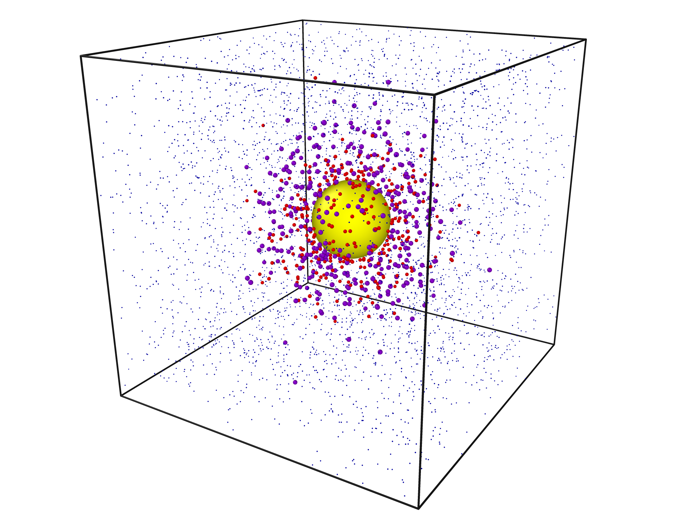

# Complex-mediated evasion - ABM

Yann Bachelot

Research Group Applied Systems Biology - Head: Prof. Dr. Marc Thilo Figge\
https://www.leibniz-hki.de/en/applied-systems-biology.html \
HKI-Center for Systems Biology of Infection\
Leibniz Institute for Natural Product Research and Infection Biology - Hans Knöll Institute (HKI)\
Adolf-Reichwein-Straße 23, 07745 Jena, Germany

The project code is licensed under BSD 2-Clause.\
See the LICENSE file provided with the code for the full license.

## Project

The Complex-mediated evasion application is based on the core repository of the Agent-Based Model (ABM) developed by the **Applied Systems Biology** team of **Leibniz-HKI**.
The main purpose of this framework includes simulating host-pathogen interactions at molecular and cellular levels.

In this application, we focus on simulating an immune evasion mechanism employed by the fungus _Candida albicans_ to protect itself against human antimicrobial peptides.

.

Example of a simulation of Complex-mediated evasion. 

## Requirements

The following software components are required to build and use the ABM framework:

- C++17 (or higher)
- Boost (>= Version 1.56)
- OpenMP (Version 4.5)
- PovRay (Version 3.7.0.8)
- CMake (recommended for build process)

## Getting started
### Build process

To build the framework, clone the repository to a local folder (here: coreABM/) and use the following commands:

`~/coreABM$ mkdir build; cd build`

Release or Debug mode: 

`~/coreABM/build$ cmake -DCMAKE_BUILD_TYPE=Release .. `
or `~/coreABM/build$ cmake -DCMAKE_BUILD_TYPE=Debug .. `

`~/coreABM/build$ make `

The compiled files can be found in the build/ folder.

### Run test configurations

To test if everything was compiled accordingly, run test configuration:

`~/coreABM/build$ cd test/`

`~/coreABM/build/test$ ./test_configurations`

(Test must be executed from the folder)

If the tests pass, the framework and its corresponding libraries were successfully installed.

### Model usage and input

To use the model, run the executable program `build/src/coreABM` with a `.json` configuration file as program argument

`~/coreABM$ build/src/coreABM <config-file>.json` 

Additional input files 
- `analyser-config.json`
- `input-config.json`
- `output-config.json`
- `simulator-config.json`
- `visualisation-config.json`

are located in the folder specified as `config_path` variable in `<config-file>.json`.

The output is written to the folder specified in the `output_path` variable in the `<config-file>.json`. 

### Output formats

The output is written to `output_path/results/SIMULATION_FOLDER/` and contains:
- measurements (if activated in `analyser-config.json`)
- XML output (if activated in `output-config.json`)
- visualization (if activated in `visualization-config.json`)

The main output format for generating data applicable to analytical models is found in `measurements/` folder.

## Configurations

Predefined configurations including test scenarios can be found in the folder `configurations/`folder. 

Config folder `configurations/basicConfig` and config file `config.json`

## General structure
The framework is structured as followed:

- **configurations**: configuration folders including `.json`files that define single scenarios
- **src**: source `.cpp` and header `.h` files of the framework
- **test**: test scenarios and unit tests using doctest library
- **cmake**: CMake specific files